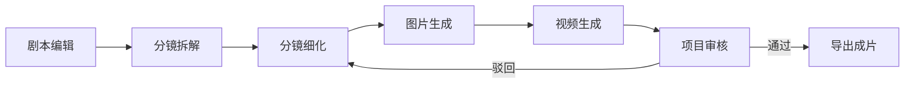

# AI短剧生产平台（前端协作版）产品需求文档

## 1. 文档目标
本版本需求用于指导“前端产品形态”开发，目标是做一个面向创作团队协作的工作流应用，而不是后台管理系统。

- 关键词：多账号协作、步骤化流转、任务交接、过程可追踪
- 非目标：传统后台 CRUD 表格管理页面

## 2. 产品定位
AI短剧生产平台是一个“创作生产线前端工作台”，帮助不同角色在统一流程中协同完成短剧生产：
剧本 -> 分镜 -> 画面 -> 视频 -> 审核 -> 出片。

## 3. 角色与权限（前端视角）

### 3.1 导演（Director）
- 创建项目与剧本
- 拆分任务并分配责任人
- 查看全流程进度与风险
- 发起终审与出片

### 3.2 编剧（Writer）
- 编辑剧情大纲/剧本段落
- 响应导演反馈并迭代版本
- 提交“可拆解”版本

### 3.3 分镜师（Storyboard Artist）
- 基于剧本编辑分镜卡片
- 维护角色/场景/镜头信息
- 生成图片并挑选候选结果

### 3.4 生成师（Generator，可与分镜师同人）
- 基于通过的分镜触发图生视频
- 处理失败重试与参数微调
- 提交“待审核”资产

### 3.5 审核（Reviewer）
- 按项目维度审核（非逐字段后台审核）
- 给出通过/驳回意见
- 驳回后回流到对应步骤

## 4. 核心流程（必须分步）

流程规则：
- 每个项目有明确“当前步骤”与“负责人”。
- 未完成前置步骤时，后续步骤按钮应置灰并提示原因。
- 每一步均有提交动作（Submit）和回退动作（Rollback）。

## 5. 前端信息架构（页面）

### 5.1 登录与身份选择页
- 用户名/密码登录
- 登录后进入“我的工作区”，按角色展示入口

### 5.2 我的工作区（首页）
- 今日任务
- 我负责的项目
- 待我处理/待我审核
- 进度总览（按步骤的漏斗/看板）

### 5.3 项目驾驶舱（Project Cockpit）
- 项目基础信息
- 当前步骤、下一步、阻塞原因
- 团队分工与在线状态
- 时间线（谁在什么时候提交了什么）

### 5.4 剧本工位
- 段落化剧本编辑
- 版本切换与差异预览
- “提交到分镜”动作

### 5.5 分镜工位（核心）
- 左侧：分镜卡片流（可排序）
- 中间：当前分镜预览（图/视频）
- 右侧：Prompt、角色、镜头、情绪、台词编辑
- 底部：评论/反馈区
- 动作：保存、提交、批量生成、批量重试

### 5.6 生成队列页
- 图片/视频任务状态（排队、生成中、成功、失败）
- 失败原因与重试入口
- 批量操作

### 5.7 审核会话页
- 审核对象为“项目版本快照”
- 审核意见分组：剧情一致性、视觉一致性、节奏
- 通过/驳回，驳回必须填写意见

### 5.8 导出与交付页
- 选择通过版本
- 导出清单（视频、分镜图、元数据）
- 下载与分享链接

## 6. 关键交互与状态机

### 6.1 项目状态
- draft（草稿）
- script_ready（剧本可拆解）
- storyboard_in_progress（分镜处理中）
- render_in_progress（生成处理中）
- in_review（审核中）
- approved（通过）
- rejected（驳回）
- exported（已导出）

### 6.2 分镜状态
- todo -> editing -> image_ready -> video_ready -> accepted

### 6.3 协作规则
- 分镜支持“锁定编辑人”，避免多人覆盖。
- 支持@成员评论和未读提醒。
- 支持“转交任务”并记录交接备注。

## 7. 前端展示原则（避免后台感）
- 使用工作台语言：工位、任务卡、流程条、时间线。
- 以卡片、画布、步骤条为主，不以表格为主。
- 首页是“我的工作”，不是“系统管理”。
- 允许沉浸式编辑（最少干扰）。

## 8. MVP范围（前端）

MVP必须包含：
- 多账号登录
- 我的工作区
- 项目步骤条 + 状态流转
- 分镜工位（编辑/生成/提交）
- 审核会话（通过/驳回）

MVP可后置：
- 实时协同光标
- 高级版本对比
- 自动排期

## 9. 验收标准
- 不同账号登录后看到不同任务入口。
- 项目能按步骤推进，不能跳步误操作。
- 每一步都有提交动作与状态可见反馈。
- 审核驳回能回流到指定步骤并保留意见。
- 页面整体体验为“创作协作前端”，而非“后台管理系统”。
